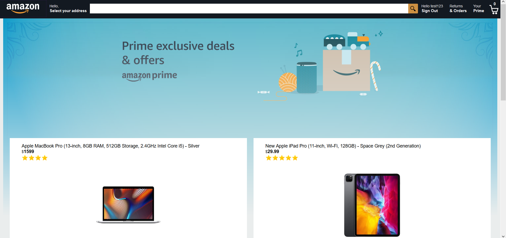
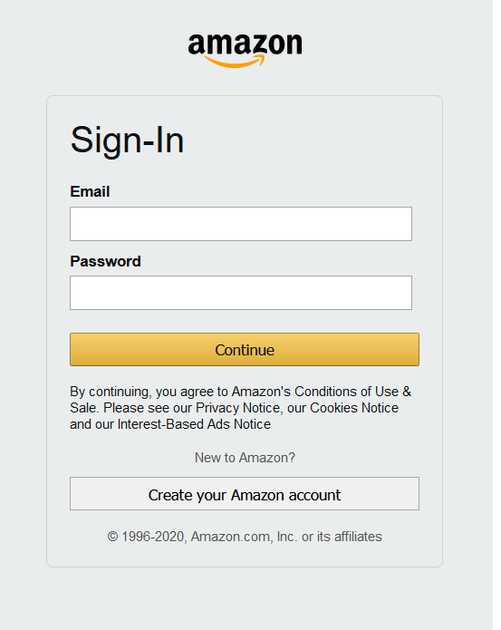
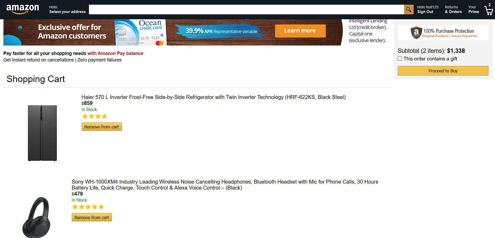
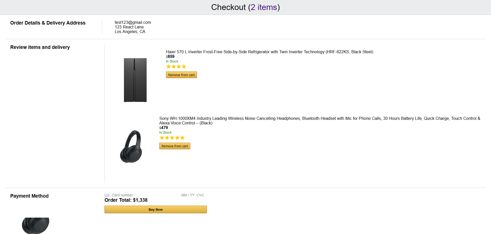
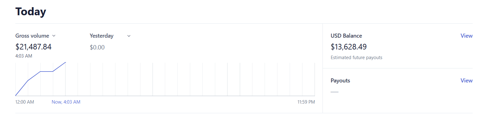

Amazon Clone build using the FERN stack.

# Screenshots

Home 

User Authentication

Cart 

Payments Page

## NOTE
Due to some firebase billing error I couldn't get my backend cloud function to deploy. Hence, the "Payment Processing" and "Your Orders" part will not be be available. 

Here is what it looks like though - 

Stripe Payment

Order History

## Alternatively
Use this test account to access orders page\
E-mail: test123\
Password: test123

## Project Link
[Website](https://tex-uwu.web.app/)

## Available Scripts

In the project directory, you can run:

### `firebase emulators:start`
Runs the express server on localhost

### `npm start`

Runs the app in the development mode.\
Open [http://localhost:3000](http://localhost:3000) to view it in the browser.

The page will reload if you make edits.\
You will also see any lint errors in the console.

### `npm test`

Launches the test runner in the interactive watch mode.\
See the section about [running tests](https://facebook.github.io/create-react-app/docs/running-tests) for more information.

### `npm run build`

Builds the app for production to the `build` folder.\
It correctly bundles React in production mode and optimizes the build for the best performance.

The build is minified and the filenames include the hashes.\
Your app is ready to be deployed!

See the section about [deployment](https://facebook.github.io/create-react-app/docs/deployment) for more information.

### `npm run eject`

**Note: this is a one-way operation. Once you `eject`, you can’t go back!**

## Contributing
Pull requests are welcome. For major changes, please open an issue first to discuss what you would like to change.

Please make sure to update tests as appropriate.

## License
[MIT](https://choosealicense.com/licenses/mit/)
